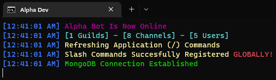

# DiscordJS Bot Base
> An advanced discord bot base

## 👑 Features
- Multiple Languages
- Slash Command Handler
- MongoDB

## 📝 Requirements
- [NodeJS 18+](https://nodejs.org/en/download/current/)
- [MongoDB 6.0.1+](https://www.mongodb.com/try/download/community)
- [MongoDB Compass (Optional)](https://www.mongodb.com/try/download/compass)

## 🚀 Installation
- Open Folder With Visual Studio Code
- Open A New Terminal On Visual Studio Code
- Type "npm install"
- Fill All Requirements In "config.json"
- After The Operation Finished, Open "Run.bat" File Or Type "node main.js" To Terminal

##

